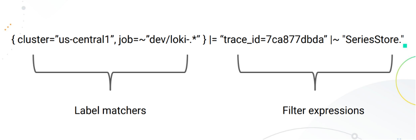
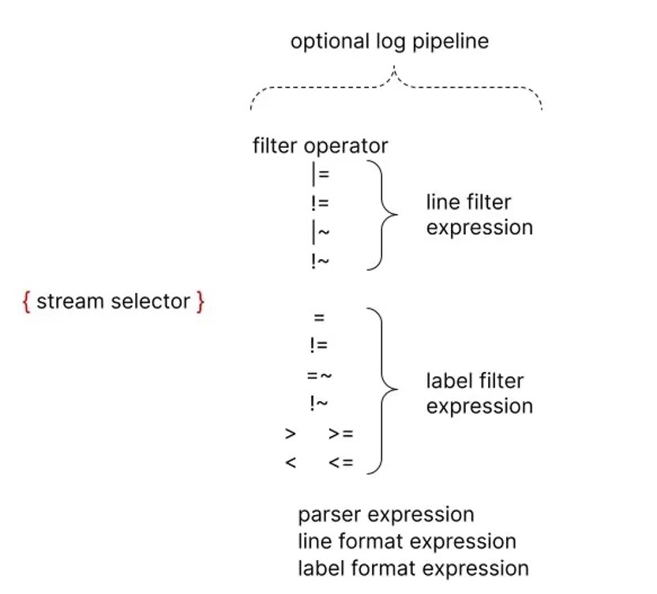

## Grafana Loki 查询语言 LogQL 使用

  受 PromQL 的启发，Loki 也有自己的查询语言，称为 LogQL 它就像一个分布式的 grep，可以聚合查看日志。
  和 PromQL 一样，LogQL 也是使用标签和运算符进行过滤的，主要有两种类型的查询功能:
  
  `1` 查询返回日志行内容

  `2` 通过过滤规则在日志流中计算相关的度量指标

### 日志查询
  
  一个基本的日志查询由两部分组成。

  `1` log stream selector (日志流选择器)

  `2` log pipeline (日志管道)

  

  由于 Loki 的设计，所有 LogQL 查询必须包含一个日志流选择器。一个 Log Stream 代表了具有相同元数据(Label 集)的日志条目。
  
  *日志流选择器* 决定了有多少日志将被搜索到，一个更细粒度的日志流选择器将搜索到流的数量减少到一个可管理的数量，通过精细的匹配日志流，可以大幅减少查询期间带来资源消耗。

  而日志流选择器后面的日志管道是可选的，用于进一步处理和过滤日志流信息，它由一组表达式组成，每个表达式都以从左到右的顺序为每个日志行执行相关过滤，每个表达式都可以过滤、解析和改变日志行内容以及各自的标签。

  

  一个完整的日志查询的操作:
    
    {container="query-frontend",namespace="loki-dev"} |= "metrics.go" | logfmt | duration > 10s and throughput_mb < 500

  该查询语句由以下几个部分组成:

  `1` 一个日志流选择器 {container="query-frontend",namespace="loki-dev"}，用于过滤 loki-dev 命名空间下面的 query-frontend 容器的日志

  `2` 然后后面跟着一个日志管道 |= "metrics.go" | logfmt | duration > 10s and throughput_mb < 500,
  该管道表示将筛选出包含 metrics.go 这个词的日志，然后解析每一行日志提取更多的表达式并进行过滤

  注意: 为了避免转义特色字符，你可以在引用字符串的时候使用单引号，而不是双引号，比如 `\w+1` 与 "\w+" 是相同的。

### Log Stream Selector

  日志流选择器决定了哪些日志流应该被包含在你的查询结果中，选择器由**一个或多个键值对**组成，其中每个键是一个日志标签，每个值是该标签的值。
  
  日志流选择器是通过将键值对包裹在一对大括号中编写的, 比如:

    {app="mysql", name="mysql-backup"}
    
  上面这个示例表示，所有标签为 app 且其值为 mysql 和标签为 name 且其值为 mysql-backup 的日志流将被包括在查询结果中。
  
  其中标签名后面的 = 运算符是一个标签匹配运算符，LogQL 中一共支持以下几种标签匹配运算符:
    
    =   : 完全匹配
    !=  : 不相等
    =~  : 正则表达式匹配
    !~  : 正则表达式不匹配

    例如:
    {name=~"mysql.+"}
    {name!~"mysql.+"}
    {name!~"mysql-\\d+"}
    适用于 Prometheus 标签选择器的规则同样适用于 Loki 日志流选择器。

### Log Pipeline
  
  日志管道可以附加到日志流选择器上，以进一步处理和过滤日志流。它通常由一个或多个表达式组成，每个表达式针对每个日志行依次执行。如果一个表达式过滤掉了日志行，则管道将在此处停止并开始处理下一行。一些表达式可以改变日志内容和各自的标签，然后可用于进一步过滤和处理后续表达式或指标查询。
  一个日志管道可以由以下部分组成:
  
  `1` 日志行过滤表达式

  `2` 解析器表达式

  `3` 标签过滤表达式

  `4` 日志行格式化表达式

  `5` 标签格式化表达式

  `6` Unwrap 表达式

  其中 unwrap 表达式是一个特殊的表达式，只能在度量查询中使用。

#### 1. 日志行过滤表达式

  日志行过滤表达式用于对匹配日志流中的聚合日志进行分布式 grep。
  编写日志流选择器后，可以使用一个搜索表达式进一步过滤得到的日志数据集，搜索表达式可以是文本或正则表达式，比如:

    {job="mysql"} |= "error"
    {name="kafka"} |~ "tsdb-ops.*io:2003"
    {name="cassandra"} |~ "error=\\w+"

    过滤运算符:
    |=  : 日志行包含的字符串
    !=  : 日志行不包含的字符串
    |~  : 日志行匹配正则表达式
    !~  : 日志行与正则表达式不匹配

    过滤运算符可以是链式的，并将按顺序过滤表达式，产生的日志行必须满足每个过滤器。当使用 |~ 和 !~ 时，可以使用 Golang 的 RE2 语法的正则表达式，默认情况下，匹配是区分大小写的，可以用 (?i) 作为正则表达式的前缀，切换为不区分大小写。

    虽然日志行过滤表达式可以放在管道的任何地方，但最好把它们放在开头，这样可以提高查询的性能，当某一行匹配时才做进一步的后续处理。例如，虽然结果是一样的，但下面的查询 {job="mysql"} |= "error" |json | line_format "{{.err}}" 会比 {job="mysql"} | json | line_format "{{.message}}" |= "error" 更快.
  
  **日志行过滤表达式是继日志流选择器之后过滤日志的最快方式。**

#### 2. 解析器表达式

  解析器表达式可以解析和提取日志内容中的标签，这些提取的标签可以用于标签过滤表达式进行过滤，或者用于指标聚合。
  
  提取的标签键将由解析器进行自动格式化，以遵循 Prometheus 指标名称的约定（它们只能包含 ASCII 字母和数字，以及下划线和冒号，不能以数字开头）。
  例如下面的日志经过管道 | json 将产生以下 Map 数据:

    { "a.b": { "c": "d" }, "e": "f" }
    ->
    {a_b_c="d", e="f"}
    
  在出现错误的情况下，例如，如果该行不是预期的格式，该日志行不会被过滤，而是会被添加一个新的 __error__ 标签。
  需要注意的是如果一个提取的标签键名已经存在于原始日志流中，那么提取的标签键将以 _extracted 作为后缀，以区分两个标签，你可以使用一个标签格式化表达式来强行覆盖原始标签，但是如果一个提取的键出现了两次，那么只有最新的标签值会被保留。
  
  目前支持 json、logfmt、pattern、regexp 和 unpack 这几种解析器。
  我们应该尽可能使用 json 和 logfmt 等预定义的解析器，这会更加容易，而当日志行结构异常时，可以使用 regexp，可以在同一日志管道中使用多个解析器，这在你解析复杂日志时很有用。

#### 3. 标签过滤表达式

  标签过滤表达式允许使用其原始和提取的标签来过滤日志行，它可以包含多个谓词。
  一个谓词包含一个标签标识符、操作符和用于比较标签的值。
  
  例如 cluster="namespace" 其中的 cluster 是标签标识符，操作符是 =，值是"namespace"。
  
  LogQL 支持从查询输入中自动推断出的多种值类型:
    
    1、String(字符串)用双引号或反引号引起来，例如"200"或`us-central1`。

    2、Duration(时间)是一串十进制数字，每个数字都有可选的数和单位后缀，如 "300ms"、"1.5h" 或 "2h45m"，有效的时间单位是 "ns"、"us"（或 "µs"）、"ms"、"s"、"m"、"h"。

    3、Number(数字)是浮点数（64 位），如 250、89.923。

    4、Bytes(字节)是一串十进制数字，每个数字都有可选的数和单位后缀，如 "42MB"、"1.5Kib" 或 "20b"，有效的字节单位是 "b"、"kib"、"kb"、"mib"、"mb"、"gib"、"gb"、"tib"、"tb"、"pib"、"bb"、"eb"。
    
  字符串类型的工作方式与 Prometheus 标签匹配器在日志流选择器中使用的方式完全一样，这意味着你可以使用同样的操作符(=、!=、=~、!~)。
  使用 Duration、Number 和 Bytes 将在比较前转换标签值，并支持以下比较器。

    1、 == 或 = 相等比较
    2、 != 不等于比较
    3、 > 和 >= 用于大于或大于等于比较
    4、 < 和 <= 用于小于或小于等于比较

  例如 logfmt | duration > 1m and bytes_consumed > 20MB 过滤表达式。

  如果标签值的转换失败，日志行就不会被过滤，而会添加一个 __error__ 标签。你可以使用 and和 or 来连接多个谓词，它们分别表示且和或的二进制操作，and 可以用逗号、空格或其他管道来表示，标签过滤器可以放在日志管道的任何地方。
  以下所有的表达式都是等价的:

    | duration >= 20ms or size == 20kb and method!~"2.."

    | duration >= 20ms or size == 20kb | method!~"2.."

    | duration >= 20ms or size == 20kb,method!~"2.."

    | duration >= 20ms or size == 20kb method!~"2.."
    
  默认情况下，多个谓词的优先级是从右到左，你可以用圆括号包装谓词，强制使用从左到右的不同优先级。例如，以下内容是等价的:

    | duration >= 20ms or method="GET" and size <= 20KB

    | ((duration >= 20ms or method="GET") and size <= 20KB)
    
  它将首先评估 duration>=20ms or method="GET"，要首先评估 method="GET" and size<=20KB，请确保使用适当的括号，如下所示。

    | duration >= 20ms or (method="GET" and size <= 20KB)

#### 4. 日志行格式化表达式

  日志行格式化表达式可以通过使用 Golang 的 text/template 模板格式重写日志行的内容，它需要一个字符串参数 | line_format "{{.label_name}}" 作为模板格式，所有的标签都是注入模板的变量，可以用 {{.label_name}} 的符号来使用。
  
  例如，下面的表达式:
  
    {container="frontend"} | logfmt | line_format "{{.query}} {{.duration}}"

  将提取并重写日志行，只包含 query 和请求的 duration。你可以为模板使用双引号字符串或反引号 `{{.label_name}}` 来避免转义特殊字符。
  此外 line_format 也支持数学函数，例如:
  如果我们有以下标签 ip=1.1.1.1, status=200 和 duration=3000(ms), 我们可以用 duration 除以 1000 得到以秒为单位的值:

    {container="frontend"} | logfmt | line_format "{{.ip}} {{.status}} {{div .duration 1000}}"

  上面的查询将得到的日志行内容为1.1.1.1 200 3。

#### 5. 标签格式化表达式
  
  | label_format 表达式可以重命名、修改或添加标签，它以逗号分隔的操作列表作为参数，可以同时进行多个操作。
  当两边都是标签标识符时，例如 dst=src，该操作将把 src 标签重命名为 dst。

  左边也可以是一个模板字符串，例如 dst="{{.status}} {{.query}}"，在这种情况下，dst 标签值会被 Golang 模板执行结果所取代，这与 | line_format 表达式是同一个模板引擎，这意味着标签可以作为变量使用，也可以使用同样的函数列表。
  在上面两种情况下，如果目标标签不存在，那么就会创建一个新的标签。
  重命名形式 dst=src 会在将 src 标签重新映射到 dst 标签后将其删除，然而，模板形式将保留引用的标签，例如 dst="{{.src}}" 的结果是 dst 和 src 都有相同的值。

  一个标签名称在每个表达式中只能出现一次，这意味着 | label_format foo=bar,foo="new" 是不允许的，但你可以使用两个表达式来达到预期效果, 比如 | label_format foo=bar | label_format foo="new"。

#### 6. Unwrap 表达式

### 日志度量
  
  LogQL 同样支持通过函数方式将日志流进行度量，通常我们可以用它来计算消息的错误率或者排序一段时间内的应用日志输出 Top N。

#### 1. 区间向量
  
  LogQL 同样也支持有限的区间向量度量语句，使用方式和 PromQL 类似，常用函数主要是如下 4 个:

    rate            : 计算每秒的日志条目
    count_over_time : 对指定范围内的每个日志流的条目进行计数
    bytes_rate      : 计算日志流每秒的字节数
    bytes_over_time : 对指定范围内的每个日志流的使用的字节数

  比如计算 nginx 的 qps:

    rate({filename="/var/log/nginx/access.log"}[5m])

  计算 kernel 过去 5 分钟发生 oom 的次数:
    
    count_over_time({filename="/var/log/message"} |~ "oom_kill_process" [5m])

#### 2. 聚合函数
  
  LogQL 也支持聚合运算，我们可用它来聚合单个向量内的元素，从而产生一个具有较少元素的新向量，当前支持的聚合函数如下:

    sum:     求和
    min:     最小值
    max:     最大值
    avg:     平均值
    stddev:  标准差
    stdvar:  标准方差
    count:   计数
    bottomk: 最小的 k 个元素
    topk:    最大的 k 个元素

  聚合函数我们可以用如下表达式描述:

    <aggr-op>([parameter,] <vector expression>) [without|by (<label list>)]

  对于需要对标签进行分组时，我们可以用 without 或者 by 来区分。比如计算 nginx 的 qps，并按照 pod 来分组:
    
    sum(rate({filename="/var/log/nginx/access.log"}[5m])) by (pod)

  只有在使用 bottomk 和 topk 函数时，我们可以对函数输入相关的参数。比如计算 nginx 的 qps 最大的前 5 个，并按照 pod 来分组:
  
    topk(5,sum(rate({filename="/var/log/nginx/access.log"}[5m])) by (pod))

#### 二元运算-数学计算
  
  Loki 存的是日志，都是文本，怎么计算呢？显然 LogQL 中的数学运算是面向区间向量操作的，LogQL 中的支持的二进制运算符如下:

    +  :  加法
    -  :  减法
    *  :  乘法
    /  :  除法
    %  :  求模
    ^  :  求幂

  比如我们要找到某个业务日志里面的错误率，就可以按照如下方式计算:

    sum(rate({app="foo", level="error"}[1m])) / sum(rate({app="foo"}[1m]))

#### 逻辑运算

  集合运算仅在区间向量范围内有效，当前支持
    and    : 并且
    or     : 或者
    unless : 排除

  比如:
   
    rate({app=~"foo|bar"}[1m]) and rate({app="bar"}[1m])

#### 比较运算

  LogQL 支持的比较运算符和 PromQL 一样，包括:

    ==  : 等于
    !=  : 不等于
    >   : 大于
    >=  : 大于或等于
    <   : 小于
    <=  : 小于或等于
  
  通常我们使用区间向量计算后会做一个阈值的比较，这对应告警是非常有用的，比如统计 5 分钟内 error 级别日志条目大于 10 的情况:
  
    count_over_time({app="foo", level="error"}[5m]) > 10

  我们也可以通过布尔计算来表达，比如统计 5 分钟内 error 级别日志条目大于 10 为真，反正则为假:

    count_over_time({app="foo", level="error"}[5m]) > bool 10

#### 注释
  
  LogQL 查询可以使用 # 字符进行注释

  https://blog.csdn.net/lqzkcx3/article/details/134341404